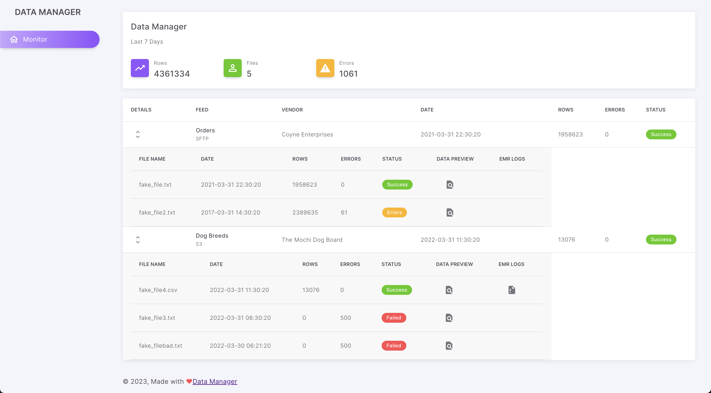

# Data Manager
Data manager is a platform that allows ingestion of flat files into a raw layer of a datalake. It requires use of AWS and uses the following technology: `terraform`, `helm`, `go`, `nextjs`, `react`, `typescript`.

## Getting Started
Installation of dependencies and how they should be setup/configured

### Prerequisites
1. Homebrew
   * ``/bin/bash -c "$(curl -fsSL https://raw.githubusercontent.com/Homebrew/install/HEAD/install.sh)"``
2. AWS CLI
   * ``brew install awscli``
3. Terraform
   * ``brew install terraform``
4. Configure AWS
   * Setup ``~/.aws/config`` and ``~/.aws/credentials`` with the expected profile. You can run ``aws configure`` if you need to set this up.

1. Make a copy of ``.env_template``, rename it to ``.env`` and update all necessary fields. In particular DOMAIN_NAME must align with the domain name you own via Route 53, AWS_ACCOUNT must be the account ID youwill be setting up resources in. AWS_PROFILE must be the name of the profile in your local ~/.aws/credentials that you will use to create resources (It will need access to all of the systems that Terraform will build)
2. To start you must had a domain name with AWS Route 53, and have an active Hosted Zone.
Take the Hosted Zone Id and update ``HOSTED_ZONE_ID`` in your .env file.
3. From project root run command ``make init`` then build the lambda with ``make build_lambda`` then plan the creation of infra  ``make plan`` and finally ``make apply`` to build the infra. This will also output an ACM ARN to your ``.env`` file.
4. You can push images to ECR, update the kubeconfig and deploy the helm chart all with one command.
   From the project roon run ``make deploy``

### Front End
The front end uses HTTPS. In your browser navigate to https://app.YOURDOMAIN.com/

### GraphQL API
The api end uses HTTPS. In your browser navigate to https://api.YOURDOMAIN/sandbox

## Database Admin
The db admin end uses HTTP. In your browser navigate to http://pgadmin.YOURDOMAIN.com
Use the credentials you set in your ``.env`` file.
